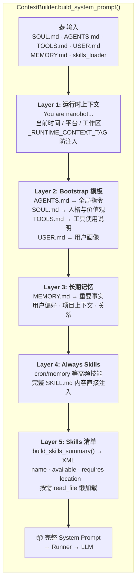
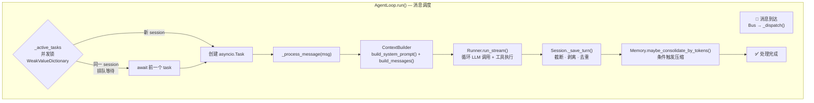
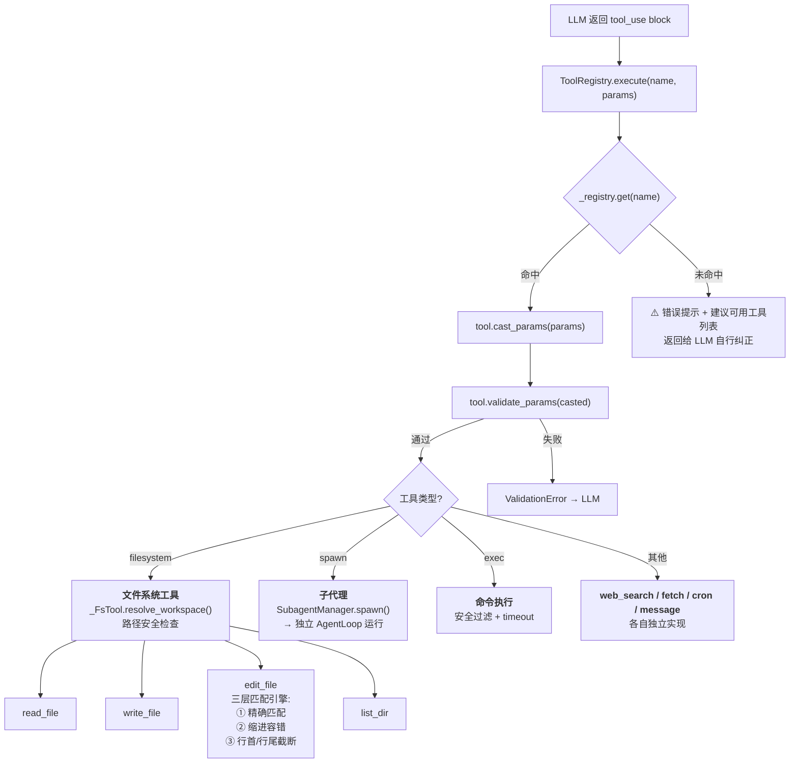
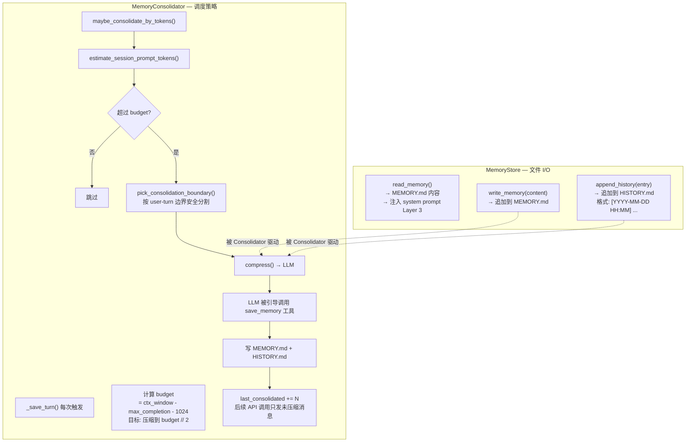
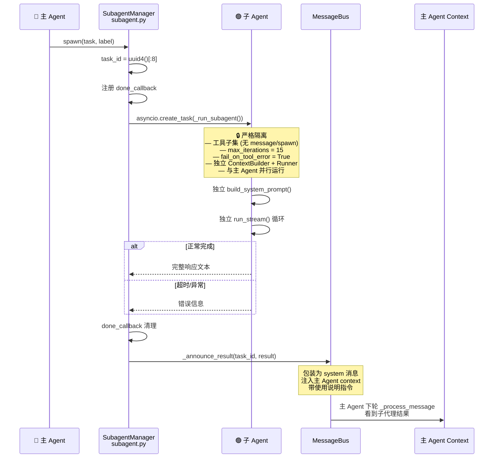
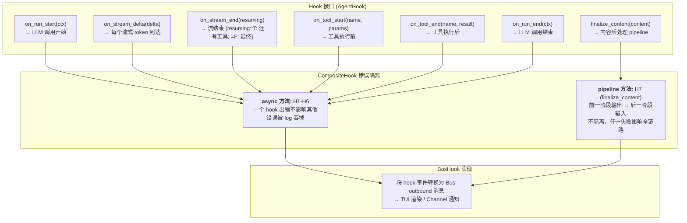
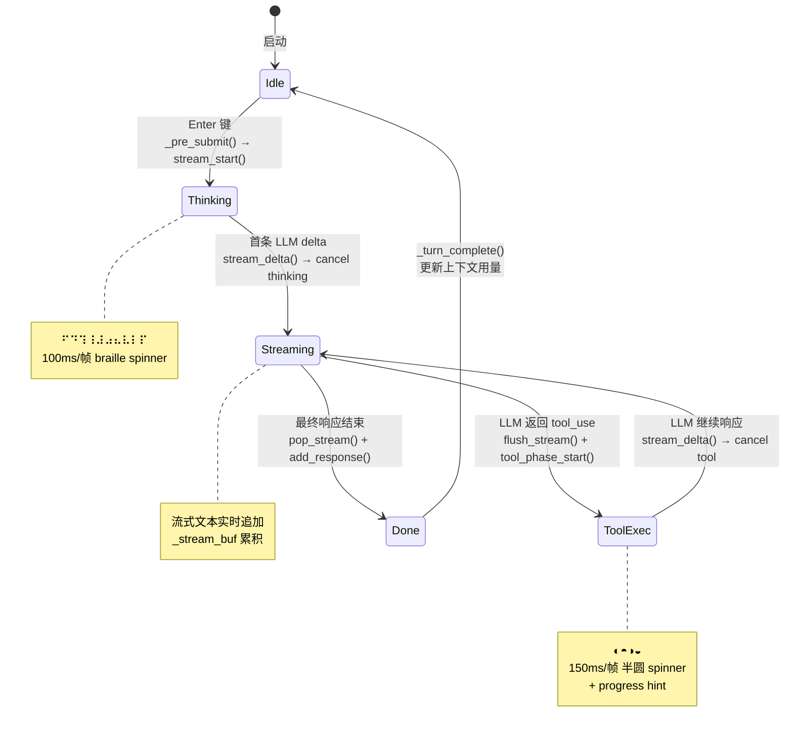
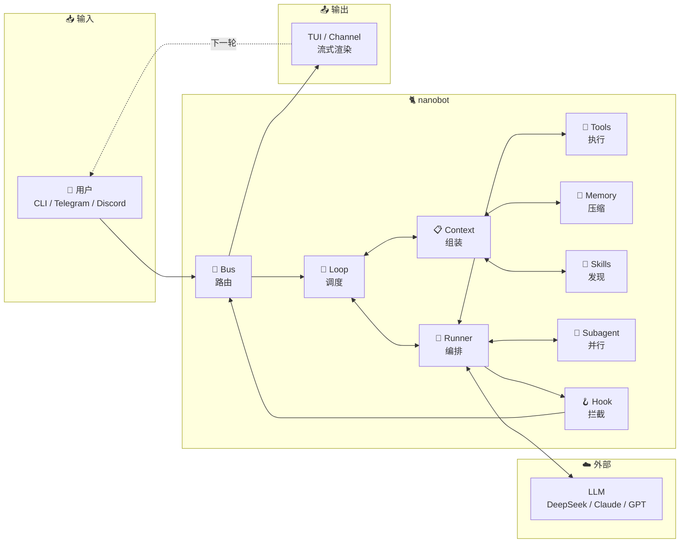

# nanobot 执行流程图

## 一、总览：一条消息的完整旅程

```mermaid
sequenceDiagram
    participant 👤 as 👤 用户
    participant TUI as TUI (prompt_toolkit)
    participant CMD as commands.py
    participant Bus as MessageBus
    participant Loop as AgentLoop<br/>loop.py
    participant Ctx as ContextBuilder<br/>context.py
    participant Runner as Runner<br/>runner.py
    participant Hook as AgentHook<br/>hook.py
    participant LLM as LLM Provider
    participant Tools as ToolRegistry<br/>tools.py
    participant Sub as SubagentManager<br/>subagent.py
    participant Mem as Memory<br/>memory.py
    participant Skills as SkillsLoader<br/>skills.py
    participant Sess as SessionManager

    Note over 👤,Sess: ═══ 阶段 0: 启动 ═══

    TUI->>Loop: AgentLoop(config, session)
    Loop->>Ctx: ContextBuilder(skills_loader, workspace)
    Loop->>Skills: 双目录扫描（内置 + 自定义）
    Loop->>Mem: MemoryStore(session_dir) → 加载 MEMORY.md
    Loop->>Sess: 加载历史会话消息
    Loop-->>TUI: 欢迎界面 + 话题选择弹窗

    Note over 👤,Sess: ═══ 阶段 1: 用户输入 → 动画启动 ═══

    👤->>TUI: 输入消息 + Enter
    TUI->>CMD: _pre_submit() 同步触发
    CMD->>TUI: stream_start() → thinking spinner 🎬
    TUI->>CMD: _on_submit() 异步调度
    CMD->>Bus: publish_inbound(msg, wants_stream=True)

    Note over 👤,Sess: ═══ 阶段 2: AgentLoop 消息调度 ═══

    Bus->>Loop: _dispatch(msg)
    Loop->>Loop: _process_message(msg)
    
    Note over 👤,Sess: ═══ 阶段 3: System Prompt 五层组装 ═══

    Loop->>Ctx: build_system_prompt()
    Note over Ctx: Layer 1: 身份声明 (SOUL.md 运行时)<br/>Layer 2: Bootstrap (AGENTS/SOUL/USER/TOOLS.md)<br/>Layer 3: MEMORY.md 长期记忆<br/>Layer 4: always skills 完整注入<br/>Layer 5: skills summary XML 清单

    Loop->>Ctx: build_messages(history, user_msg)
    Note over Ctx: merged user message + 工具结果拼接

    Note over 👤,Sess: ═══ 阶段 4: Runner 调用 LLM ═══

    Loop->>Runner: run_stream(system, messages, tools, hooks)
    Runner->>Hook: on_run_start(ctx)
    Runner->>LLM: send_message(...)

    loop 流式响应
        LLM-->>Runner: stream delta
        Runner->>Hook: on_stream_delta(delta)
        Hook-->>Bus: _stream_delta → TUI 实时渲染
    end

    Note over 👤,Sess: ═══ 阶段 5: 工具调用循环 ═══

    alt LLM 返回 tool_use
        LLM-->>Runner: tool_use blocks
        Runner->>Hook: on_stream_end(resuming=True)
        Hook-->>Bus: _stream_end → TUI: tool_phase_start()

        loop 每个工具
            Runner->>Hook: on_tool_start(name, params)
            Runner->>Tools: execute(name, params)

            alt spawn 工具
                Tools->>Sub: SubagentManager.spawn(task)
                Note over Sub: 独立 AgentLoop<br/>工具子集（无 message/spawn）<br/>max_iterations=15<br/>asyncio.create_task 后台运行
                Sub-->>Tools: task_id
            else 普通工具
                Tools-->>Runner: tool_result
            end

            Runner->>Hook: on_tool_end(name, result)
        end

        Runner->>LLM: send_message(带工具结果继续)
    end

    Note over 👤,Sess: ═══ 阶段 6: 最终响应 ═══

    LLM-->>Runner: 最终文本
    Runner->>Hook: on_stream_end(resuming=False)
    Hook-->>Bus: _streamed → TUI: pop_stream() + add_response()
    Runner->>Hook: on_run_end(ctx)
    Runner-->>Loop: 完整响应

    Note over 👤,Sess: ═══ 阶段 7: 持久化与记忆压缩 ═══

    Loop->>Sess: _save_turn(user_msg, assistant_msg)
    Note over Sess: 截断/剥离/去重

    Loop->>Mem: maybe_consolidate_by_tokens()
    Note over Mem: budget = ctx_window - max_completion - 1024<br/>pick_consolidation_boundary() user-turn 分割<br/>compress() → LLM 调 save_memory<br/>→ MEMORY.md + HISTORY.md 双写<br/>last_consolidated 递增

    Bus-->>TUI: _turn_complete() → 更新上下文用量 %
    Note over TUI: ctx: 2% ▌...
```

---

## 二、ContextBuilder 五层组装



---

## 三、AgentLoop 核心管线



---

## 四、工具系统全路径



---

## 五、Memory 双层架构



---

## 六、Subagent 隔离机制



---

## 七、Hook 策略模式



---

## 八、TUI 渲染状态机



---

## 九、模块职责速查

| 模块 | 文件 | 核心职责 | 关键概念 |
|:--|:--|:--|:--|
| **ContextBuilder** | `context.py` (202行) | 五层 prompt 组装 | SOUL/AGENTS/USER/TOOLS/MEMORY skills |
| **AgentLoop** | `loop.py` | 消息调度管线 | WeakValueDictionary 并发锁、_process_message |
| **Runner** | `runner.py` | LLM 调用编排 | 工具循环 → send_message 直到无 tool_use |
| **AgentHook** | `hook.py` (108行) | 7 方法生命周期 | CompositeHook 错误隔离、BusHook 实现 |
| **ToolRegistry** | `tools/` | 工具注册/查找/执行 | cast_params → validate_params → execute |
| **FilesystemTools** | `tools/filesystem.py` | 4 个文件工具 | _FsTool 路径安全、EditFile 三层匹配 |
| **MemoryStore** | `memory.py` | 文件 I/O | MEMORY.md / HISTORY.md 双文件 |
| **MemoryConsolidator** | `memory.py` | 自动压缩调度 | budget 计算、user-turn 边界、LLM 驱动压缩 |
| **SubagentManager** | `subagent.py` (263行) | 后台隔离代理 | 工具子集、max_iterations=15、并行运行 |
| **SkillsLoader** | `skills.py` (228行) | 技能发现/加载 | 双目录扫描、依赖检查、XML summary |
| **Provider** | `providers/` | LLM API 适配 | Anthropic/OpenAI/DeepSeek/OAuth |
| **TUI** | `cli/tui.py` | 分屏终端 UI | prompt_toolkit、spinner 动画、滚动 |
| **MessageBus** | `bus/` | 消息路由 | inbound/outbound、handler 注册 |

---

## 十、数据流一图总览


